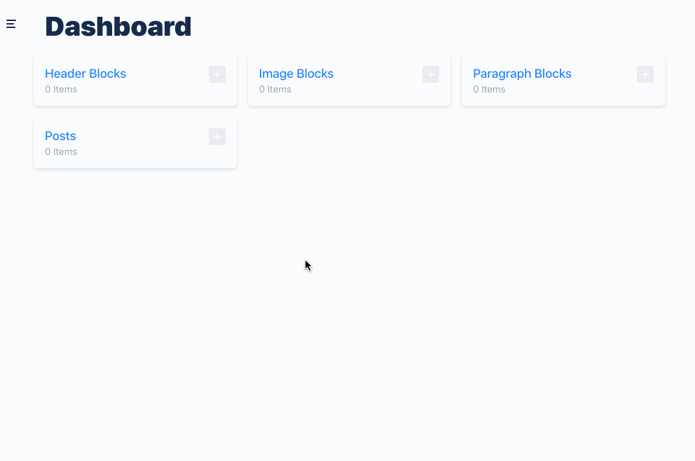

# Polymorphic Keystone Queries

By default, Keystone does not support the ability to query in a polymorphic way. Ie; it cannot return an array of results which each element being of a different type.

GraphQL does provide the `Union` type however, so we can leverage that by extending our Keystone's GraphQL API.

Check out [`index.js`](./index.js) for the complete example.

